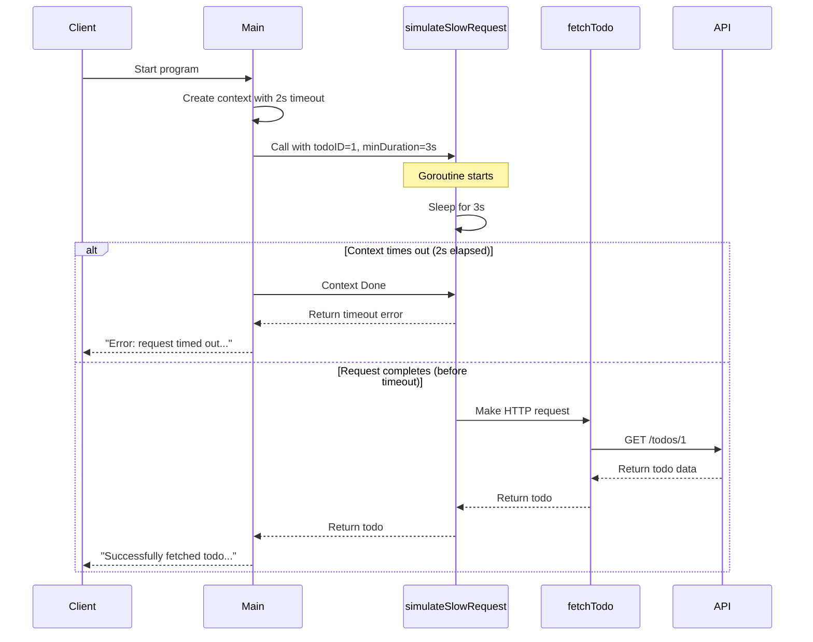

# Go Context Timeout Example

This example demonstrates how to use Go's context package to handle timeouts in HTTP requests.

## Flow Diagram



## How It Works

1. The program creates a context with a 2-second timeout
2. It calls `simulateSlowRequest` with a minimum duration of 3 seconds
3. The request is designed to take longer than the context timeout
4. The context cancels the operation after 2 seconds
5. The program handles the timeout gracefully

## Running the Example

```bash
go run main.go
```

## Expected Output

When the request times out:
```
2023/10/07 12:25:00 Fetching todo with ID 1...
2023/10/07 12:25:02 Error: request timed out after 3s: context deadline exceeded
2023/10/07 12:25:02 This demonstrates how context timeout prevents waiting too long for a response.
```

When the request succeeds (if you reduce the minDuration to less than 2s):
```
2023/10/07 12:30:00 Fetching todo with ID 1...
2023/10/07 12:30:01 Successfully fetched todo: &{UserID:1 ID:1 Title:delectus aut autem Completed:false}
```

## Contributing

Contributions are welcome! Please feel free to submit a Pull Request.

## License

This project is licensed under the MIT License - see the [LICENSE](LICENSE) file for details.